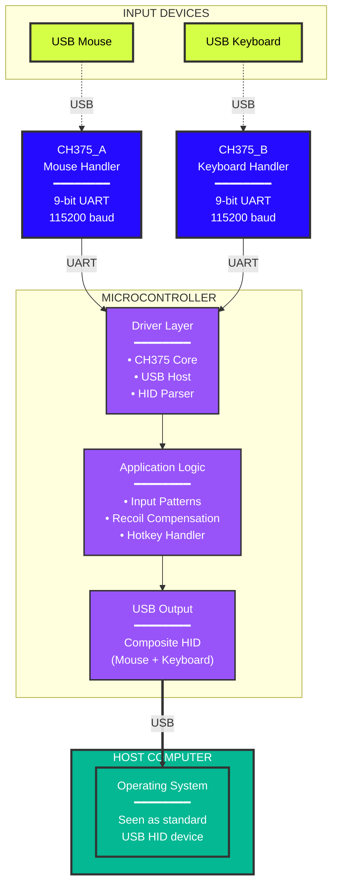

# GhostHIDe - Advanced USB HID Proxy with Real-Time Input Modification


## Overview

**GhostHIDe** is a USB HID proxy system that sits transparently between your input devices and PC, enabling real-time modification of mouse and keyboard data. Built on Zephyr RTOS for embedded platforms, it features pattern-based input compensation.

### Key Features

**Universal HID Support**
- Dynamic report descriptor parsing supports mice with 3-16 buttons, 8/16-bit axes and wheel
- Standard 6-key rollover keyboards with modifier key support

**Real-Time Input Modification**
- Pattern-based recoil compensation system
- Configurable coefficients and sensitivity on-the-fly
- Hotkey-based profile switching

**Multi-Platform Architecture**
- **stm32f4_disco** - Primary platform with manual 9-bit UART
- **Raspberry Pi Pico family** - PIO-based 9-bit UART implementation (Pico, Pico W, Pico 2, Pico 2 W)
- Hardware abstraction layer enables easy platform additions

**Production-Grade Testing**
- Mock hardware layer for isolated testing
- Real-world device descriptor validation

---

## Table of Contents

- [Architecture](#architecture)
- [Hardware Requirements](#hardware-requirements)
- [Getting Started](#getting-started)
- [Build Options](#build-options)
- [Hardware Setup](#hardware-setup)
- [Usage Guide](#usage-guide)
- [Profile Management](#profile-management)
- [Unit Tests](#unit-tests)
- [License](#license)

---

## Architecture

### System Block Diagram




## Hardware Requirements

### Supported Platforms

#### Option 1: Raspberry Pi Pico Family
- **Supported Boards**:
  - **Raspberry Pi Pico** (RP2040) - `rpi_pico`
  - **Raspberry Pi Pico W** (RP2040 with WiFi) - `rpi_pico/rp2040/w`
  - **Raspberry Pi Pico 2** (RP2350A) - `rpi_pico2/rp2350a/m33`
  - **Raspberry Pi Pico 2 W** (RP2350A with WiFi) - `rpi_pico2/rp2350a/m33/w`

- **Peripherals**:
  - PIO0 SM0/SM1 (GP4/GP5) - PIO UART for one of CH375 chips
  - PIO1 SM0/SM1 (GP8/GP9) - PIO UART for the other CH375 chip
  - UART0 (GP0/GP1) - Console at 115200 baud
  - USB Device - Device output
- **Power**: USB-powered

#### Option 2: STM32F4 Discovery
- **Board**: stm32f4_disco (STM32F407VGT6)
- **Peripherals**:
  - USART2 (PA2/PA3) - PIO UART for one of CH375 chips
  - USART3 (PB10/PB11) - PIO UART for the other CH375 chip
  - UART4 (PC10/PA1) - Console at 115200 baud
  - USB OTG FS - Device output (micro USB)
- **Power**: USB-powered (mini USB)

## Getting Started

1. **Zephyr Development Environment**
   ```bash
   # Follow official guide
   https://docs.zephyrproject.org/latest/develop/getting_started/index.html
   ```

2. **Platform-Specific Tools**
   - **STM32F4**: ARM GCC toolchain, STM32CubeProgrammer
   - **RP2040/RP2350**: Raspberry Pi Pico SDK, picotool, picoasm

### Build and Flash

```bash
# Clone repository
git clone https://github.com/akaDestrocore/GhostHIDe.git
cd GhostHIDe

# Build for stm32f4_disco
west build -p always -b stm32f4_disco /path/to/GhostHIDe/
west flash

# Or build for Raspberry Pi Pico (RP2040)
west build -p always -b rpi_pico /path/to/GhostHIDe/

# Or build for Raspberry Pi Pico W (RP2040 with CYW43439)
west build -p always -b rpi_pico/rp2040/w /path/to/GhostHIDe/

# Or build for Raspberry Pi Pico 2 (RP2350A)
west build -p always -b rpi_pico2/rp2350a/m33 /path/to/GhostHIDe/

# Or build for Raspberry Pi Pico 2 W (RP2350A with CYW43439)
west build -p always -b rpi_pico2/rp2350a/m33/w /path/to/GhostHIDe/

# Flash by dragging .uf2 from Zephyr build directory to RPI-RP2 drive in BOOTSEL mode
```

### First Run

1. **Connect Hardware**:
   - Wire CH375's RX pin to MCU's TX and CH375's TX to MCU's RX, make sure to have common GND
   - Connect USB mouse to CH375_A
   - Connect USB keyboard to CH375_B
   - Connect microcontroller USB to PC

2. **Monitor Console**:
Either use a serial terminal application with GUI or minicom. Serial console is only needed to see feedback from MCU.

3. **Verify Operation**:
   - Console shows device enumeration
   - PC recognizes composite HID device
   - Mouse and keyboard function normally (by default forwards inputs without HID modification until you enable any profile)

---

## Build Options

### Configuration Options

Edit `prj.conf` to customize:

```ini
# USB Device Configuration
CONFIG_USB_DEVICE_VID=0x1E7D                            # Vendor ID
CONFIG_USB_DEVICE_PID=0x2E7C                            # Product ID
CONFIG_USB_DEVICE_MANUFACTURER="GhostHIDe"              # Manufacturer string
CONFIG_USB_DEVICE_PRODUCT="Composite USB HID Device"    # Product string

# Logging Levels
CONFIG_LOG_DEFAULT_LEVEL=3                              # 0=OFF, 1=ERR, 2=WRN, 3=INF, 4=DBG

# Performance Tuning
CONFIG_MAIN_STACK_SIZE=4096                             # Main thread stack
CONFIG_HEAP_MEM_POOL_SIZE=16384                         # Dynamic allocation pool
```

### Adding a New Platform

To support additional hardware:

1. **Create Platform-Specific UART Driver**:
   ```c
   // drivers/ch375/src/ch375_uart_whatevernewplatform.c
   int ch375_newplatform_hw_init(const char *name, int uart_index, 
                                  const struct gpio_dt_spec *int_gpio,
                                  uint32_t initial_baudrate,
                                  struct ch375_Context_t **ppCtxOut);
   
   int ch375_newplatform_set_baudrate(struct ch375_Context_t *pCtx, 
                                      uint32_t baudrate);
   ```

2. **Update Hardware Abstraction**:
   ```c
   // drivers/ch375/src/ch375_uart.c
   #elif defined(CONFIG_SOC_SERIES_WHATEVERNEWPLATFORM)
       extern int ch375_newplatform_hw_init(...);
       extern int ch375_newplatform_set_baudrate(...);
   #endif
   ```

3. **Add Device Tree Overlay**:
   ```dts
   // boards/newplatform.overlay
   / {
       chosen {
           zephyr,console = &uart0;
       };
   };
   // ... configure peripherals
   ```

4. **Update CMakeLists.txt**:
   ```cmake
   elseif(CONFIG_SOC_SERIES_NEWPLATFORM)
       target_sources(app PRIVATE
           drivers/ch375/src/ch375_uart_newplatform.c
       )
   endif()
   ```

---

## Hardware Setup

### CH375 Module Configuration

**CRITICAL**: CH375 modules must be configured for **UART mode**, not SPI mode. Also check your module's H1 jumper to be in serial mode:


Consult your exact module's datasheet for pin locations. I personally used two different CH375 boards that have a bit different configuration.

### Power Considerations

- **stm32f4_disco**: Powered via USB
- **rpi_pico/rpi_pico2**: Uses VBUS for both CH375 - may need external 5V supply for power-hungry devices (see RP2040/RP2350 hardware documentation)
- in some cases on-board pull up resistance may not be enough for CH375 RX pin, so you may add another 10kOhms as pull up in that case. 

## Usage Guide

### Default Controls

Once running, GhostHIDe forwards all inputs transparently. Use these **keyboard hotkeys** to control recoil compensation:

## Profile Management
| Key | Function |
|-----|----------|
| **Page Up** | Enable recoil compensation |
| **Page Down** | Disable recoil compensation |
| **1** | Load Soldier 76 profile (Overwatch 2) |
| **2** | Load Cassidy profile (Overwatch 2) |

#### On the fly tuning
| Key | Function |
|-----|----------|
| **+** (Equals) | Increase compensation coefficient (+0.1) |
| **-** (Minus) | Decrease compensation coefficient (-0.1) |
| **<** (Comma) | Increase sensitivity adjustment (+0.1) |
| **>** (Period) | Decrease sensitivity adjustment (-0.1) |

### Recoil Compensation System

The system applies mouse movement patterns when **Left Mouse Button** is pressed:

1. **Profile Selection**: Choose weapon/character profile (number hotkeys)
2. **Enable Compensation**: Press Page Up
3. **Fire Weapon**: Hold LMB - compensation activates automatically
4. **Release**: Release LMB - compensation stops
5. **Fine-Tune**: Adjust coefficient/sensitivity while testing

#### Understanding Parameters

- **Coefficient** (`0.1 - 10.0`, default `1.0`)
  - Scales the **strength** of compensation
  - Higher = more aggressive compensation pull
  - Lower = gentler compensation
  
- **Sensitivity** (`0.1 - 100.0`, default `2.5`)
  - Scales compensation relative to your **in-game sensitivity**
  - Match this to your actual mouse DPI / game sensitivity
  - Higher sensitivity = less compensation needed

### Step-by-Step: Adding a New Profile

#### 1. Define Pattern Data

Add your pattern to `src/input_patterns.c`:


**Tips**:
- Use high precision for X/Y values (5 decimal places)
- Time values should match weapon's fire rate
- Include all shots in a magazine (pattern loops if magazine longer)

#### 2. Register in Collection Array

Find the `sRecoilCollectArr` array and add your entry:

```c
#define RECOIL_COMP_PRESET_COUNT 4  // Increment this!

static const PresetCollection_t sRecoilCollectArr[RECOIL_COMP_PRESET_COUNT] = {
    
    { .pData = NULL, .dataLen = 0, .firerounds_sampling = 0 }, // Slot 0: Empty
    
    { 
        .pData = gRawPreset_OW2_Soldier76,
        .dataLen = ARRAY_SIZE(gRawPreset_OW2_Soldier76),
        .firerounds_sampling = round(111/USB_REPORT_INTERVAL),
    },
    
    { 
        .pData = gRawPreset_OW2_Cassidy,
        .dataLen = ARRAY_SIZE(gRawPreset_OW2_Cassidy),
        .firerounds_sampling = round(500/USB_REPORT_INTERVAL),
    },
    
    // Add new entries below
};
```

**`firerounds_sampling` Explanation**:
- Divides fire interval by USB report interval (8ms standard)
- Example: 90ms fire rate → `90/8 = 11.25` → `round(11.25) = 11` samples per shot
- This determines how compensation is distributed across USB reports

#### 3. Add Enum Entry

Update the enum in `include/input_patterns.h`:

```c
typedef enum {
    TEMPLATE_NONE,
    TEMPLATE_OW2_SOLDIER76,
    TEMPLATE_OW2_CASSIDY,
    // Add your new template/profile
} PatternPreset_e;
```

#### 4. Bind to Hotkey

In `src/main.c`, add hotkey handling:

```c
static int handleKeyboardInput(DeviceInput_t *pDevIn) {
    
    // Bindings for S76 and Cassidy above

    // Bind to keyboard "3" key
    hidKeyboard_GetKey(&pDevIn->keyboard, HID_KBD_NUMBER('3'), &value, false);
    if (0 != value) {
        int res = recoilComp_setPreset(gRecoilCompCtx, TEMPLATE_APEX_R301);
        if (0 == res) {
            LOG_INF("[ OK ] Selected: New profile");
        }
    }
    
    // Rest of the code
}
```

---

## Unit Tests

```bash
# Run all tests
west twister -T /path/to/GhostHIDe/tests/unit/ch375 -p native_sim
```
---

## License

This project is licensed under the GNU General Public License v3.0 or later.

Copyright (c) 2025 akaDestrocore

This program is free software: you can redistribute it and/or modify
it under the terms of the GNU General Public License as published by
the Free Software Foundation, either version 3 of the License, or
(at your option) any later version.

See [LICENSE](LICENSE) for full details.

### Third-Party Components

- **Zephyr RTOS**: Apache License 2.0
- **CH375 Datasheet**: WCH (reference only)
- **RP2040/RP2350 PIO**: Raspberry Pi Ltd. examples adapted
---

## Disclaimer

This project is intended for **educational and personal use only**. Use of input modification in competitive online games may violate terms of service. The authors are not responsible for bans, suspensions, or other consequences resulting from use of this software. Always check game/platform policies before use.